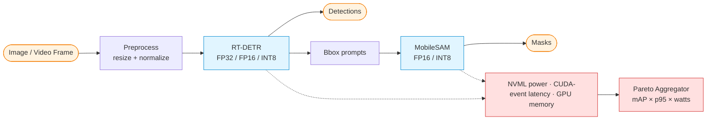

<div align="center">

# edge-vision

### Real-time detection + segmentation, squeezed for the edge — RT-DETR + MobileSAM + TensorRT/INT8, on a quality × latency × watts Pareto frontier.

[](https://www.python.org/downloads/)
[](LICENSE)
[](BUILD_PLAN.md)
[](https://github.com/sandroama/edge-vision/actions/workflows/ci.yml)
[](https://docs.astral.sh/ruff/)
[-ff9d00)](hf_space/app.py)

[**Quickstart**](#quickstart) · [**Usage**](docs/USAGE.md) · [**Development**](docs/DEVELOPMENT.md) · [**API**](docs/API.md) · [**Build plan**](BUILD_PLAN.md) · [**Research questions**](docs/research_questions.md) · [**Evaluation report**](docs/EVALUATION_REPORT.md) · [**Next steps**](NEXT_STEPS.md)

</div>

> **Headline results**
>
> | What | Status |
> |---|---|
> | Pipeline depth — Phases 0–5 (baseline → ONNX/TRT → INT8 → distill/prune → power+thermal) | **Wired, CPU/mock smoke green** |
> | Test coverage — **191 test functions** across 24 files (most-tested project in the portfolio) | Full `pytest -q`: **183 pass / 8 skip / 0 fail** on CPU (bleeding-edge wheels; 3 of the skips are torch≥2.12 drift, version-guarded — see Testing note below) |
> | **CPU INT8 lane — MEASURED** — ONNX Runtime `quantize_dynamic`: **72.5% smaller** model, CPU p50 1.27 ms (FP32) → 3.87 ms (INT8) | ✅ **real numbers, no GPU** ([phase3_cpu_int8.md](docs/results/phase3_cpu_int8.md)) |
> | **CPU pruning lane — MEASURED** — L1-mask sweep {20/40/60/80%}: raw ONNX size **flat**, **no latency change** (honest null result); **structured channel removal** (the fix): **−78.8% size and 0.545× latency at 80%**, fidelity cost measured; structured 40%+INT8 compounds to **−82.4% size** | ✅ **real numbers, no GPU** ([phase4_cpu_pruning.md](docs/results/phase4_cpu_pruning.md)) |
> | GPU lane — TensorRT FP16/INT8 latency + NVML watts/frame Pareto across 7 configs | 🟡 **GPU-pending** ([NEXT_STEPS.md](NEXT_STEPS.md)) |
> | Real deployment targets — RTX 5080 (Blackwell) **and** ONNX-Runtime CPU fallback | Both paths runnable |
>
> **Two lanes, reported separately.** The **CPU lane is measured** today on a laptop:
> ONNX dynamic INT8 gives a real, reproducible **72.5% file-size reduction** with full
> CPU p50/p95/p99 latency + bootstrap 95% CIs ([phase3_cpu_int8.md](docs/results/phase3_cpu_int8.md)).
> The **GPU lane** — TensorRT FP16/INT8 latency and NVML watts/frame, the headline
> Pareto plot — stays **pending an RTX-class GPU run** ([NEXT_STEPS.md](NEXT_STEPS.md));
> none of those numbers are claimed here.
>
> *Honest latency note: on the small CI-stand-in graph used for the no-GPU run, dynamic
> INT8 is actually ~3× **slower** on CPU (per-op quant/dequant overhead dominates a
> memory-light graph) — reported exactly as measured. The size reduction is the robust
> CPU-lane win; INT8 **latency** gains are a GPU/TensorRT story.*
>
> *Honest pruning note: the pruning axis is measured the same way
> ([phase4_cpu_pruning.md](docs/results/phase4_cpu_pruning.md)) and the primary
> finding is also negative — L1 **mask** pruning at 20–80% sparsity leaves raw ONNX
> size and dense CPU latency unchanged (zeros are stored and computed dense). The
> real signals: gzip-9 compressed size falls monotonically (3027 → 934 KiB at 80%),
> output fidelity vs the unpruned model degrades (cosine 0.9987 → 0.9223 on logits —
> a fidelity proxy on a random-init model, NOT task accuracy), and stacking
> pruning+INT8 keeps INT8's −72.5% size cut. **The channel-removal lever is now
> built and measured** (`edgevision.pruning.channel_prune_conv_chain`): truly
> removing channels cuts raw ONNX size monotonically (−78.8% at 80%) and dense
> CPU latency to 0.545× — at a measured fidelity cost (cosine 0.9014 at 80%,
> no retraining performed), and structured 40%+INT8 compounds to −82.4% size.*

---

## The pitch

> *"I took RT-DETR and made it real-time on actual hardware. INT8, distillation, ONNX → TensorRT, watts per frame, thermal throttling — all on the same harness, on RTX 5080 with a CPU fallback. Here's the Pareto frontier."*

Most CV portfolios stop at *"I trained a detector and got X mAP."* This one is built to answer the question recruiters at NVIDIA, Apple AIML, Skydio, Figure AI, and on-device AI startups screen for: **at a fixed latency or power budget, which (model, precision, compile-target) configuration Pareto-dominates?** The full deployment engineering pipeline — quantization, distillation, compilation, and power/thermal profiling — is wired end-to-end and exercised by 191 tests on CPU. The **CPU INT8 lane is measured today** (real ONNX-Runtime size + latency, [phase3_cpu_int8.md](docs/results/phase3_cpu_int8.md)); the headline **GPU** numbers (TensorRT + NVML watts) are one rented-GPU run away ([NEXT_STEPS.md](NEXT_STEPS.md)).

---

## The 5 Research Questions

- **RQ-E1.** Accuracy retention under PTQ: how does mAP@COCO degrade FP32 → FP16 → INT8 (per-tensor vs per-channel) for RT-DETR-R50?
- **RQ-E2.** Distillation gain at fixed latency: at a fixed p95 budget, can a distilled R18 student beat a quantized R50 teacher on mAP?
- **RQ-E3.** Compile-pipeline speed-up: PyTorch eager → ONNX → TensorRT INT8 — per-stage latency, FPS, memory; ONNX-CPU as the no-GPU baseline.
- **RQ-E4.** Power-latency frontier: watts/frame (NVML), p95 latency, thermal throttling under sustained 15-min load. **The headline plot.**
- **RQ-E5.** Promptable seg head bolt-on: adding MobileSAM after detection — what does it cost, and does the joint pipeline still hit ≥30 FPS on RTX 5080?

Full RQ definitions: [docs/research_questions.md](docs/research_questions.md). Phase plan: [BUILD_PLAN.md](BUILD_PLAN.md).

---

## Architecture



---

## Hardware targets

| Target | Status | Role |
|---|---|---|
| RTX 5080 (Blackwell, 16 GB) + Ryzen 9 9950X + 64 GB RAM | ✅ owned | Training + TensorRT FP16/INT8 + sustained NVML power runs |
| CPU-only via ONNX Runtime | ✅ supported | "No-GPU" demo path — runs on any laptop, used for HF Space |
| Jetson Orin Nano | 🟡 stub | Phase-7 placeholder; ONNX-first pipeline makes deploying a config change |

The plan deliberately produces **two real deployment targets** (RTX-Blackwell and CPU) instead of one. The "edge" framing is *real-time on-prem GPU + CPU fallback*, not embedded battery devices.

---

## Quickstart

```bash
git clone https://github.com/sandroama/edge-vision.git && cd edge-vision

# Set up environment
python -m venv .venv && source .venv/bin/activate
pip install -e ".[dev]"

# Verify the package
make test       # pytest tests/  → scaffold green
make smoke      # Phase 1+ → run RT-DETR on a 16-image COCO subset

# Compile + bench (Phase 2+)
make export-onnx      # torch → ONNX
make build-trt        # ONNX → TensorRT engine (FP16)
make bench            # p50/p95/p99 latency + FPS

# Power sweep (Phase 5+)
make power-sweep      # 15-min sustained run, NVML samples, thermal log

# Live demo (Phase 6+)
make api              # http://localhost:8000/docs
make ui               # http://localhost:8501
```

GPU paths require the `[gpu]` extras: `pip install -e ".[dev,gpu]"`. CPU-only path works without TensorRT.

---

## What works today

Status legend: **✅ wired + tested** = code complete and exercised by CPU/mock tests in CI · **🟢 GPU-pending** = code wired and CPU/mock-tested, but the *headline numbers* need an RTX-class GPU run ([NEXT_STEPS.md](NEXT_STEPS.md)) · **⏳ Phase 6** = not yet started.

| Module | Status | What it does |
|---|---|---|
| Project scaffold | ✅ wired + tested | Repo skeleton + CI + Makefile + module tree (Phase 0) |
| `schemas.py` | ✅ wired + tested | `BoundingBox`, `Detection`, `GroundTruthBox`, `Image`, `ImageDetections` (Phase 1) |
| `data/coco_loader.py` | ✅ wired + tested | `CocoDataset.from_json` (real) + `.synthetic` (CI) + COCO round-trip (Phase 1) |
| `data/preprocessor.py` | ✅ wired + tested | numpy-only letterbox + ImageNet normalize + un-letterbox (Phase 1) |
| `models/rtdetr_wrapper.py` | 🟢 GPU-pending | `MockRTDetrDetector` ✅ tested; `RTDetrDetector` (HF, lazy-imported) needs GPU (Phase 1) |
| `evaluation/coco_eval.py` | ✅ wired + tested | pycocotools mAP backend + simple-IoU fallback (Phase 1) |
| `scripts/run_baseline_smoke.py` | ✅ wired + tested | `--backend mock\|rtdetr`, `--eval-backend auto\|pycocotools\|simple` (Phase 1) |
| `inference/latency_harness.py` | ✅ wired + tested | CUDA-event + perf_counter p50/p95/p99 with auto-dispatch (Phase 2) |
| `models/tiny_model.py` | ✅ wired + tested | RT-DETR-shaped tiny detector for CI export tests (Phase 2) |
| `compile/onnx_export.py` | ✅ wired + tested | torch.onnx export, opset 17, `verify_onnx` returns full graph metadata (Phase 2) |
| `compile/onnxrt_cpu.py` | ✅ wired + tested | ONNX Runtime CPU executor + `make_callable` for the latency harness (Phase 2) |
| `compile/trt_build.py` | 🟢 GPU-pending | TensorRT FP32/FP16 builder (build-time path GPU-gated); INT8 calibrator hook for Phase 3 |
| `scripts/run_compile_smoke.py` | ✅ wired + tested | `--stage onnx\|onnxrt\|trt\|all` end-to-end pipeline check (Phase 2) |
| `scripts/run_latency_sweep.py` | 🟢 GPU-pending | Multi-backend latency bench writing JSON for the Pareto aggregator (Phase 2) |
| `quantization/calib_dataset.py` | ✅ wired + tested | Uniform / stratified / first sampling + `BatchProvider` (Phase 3) |
| `quantization/trt_int8.py` | 🟢 GPU-pending | TRT INT8 PTQ with entropy calibrator + cache (Phase 3) |
| `quantization/onnx_qdq.py` | ✅ wired + tested | ONNX QDQ **static** quantization, per-channel QInt8 default (Phase 3, CPU; the data-bearing RQ-E1 path) |
| `scripts/bench_cpu_int8.py` | ✅ **measured** | ONNX **dynamic** INT8 (`quantize_dynamic`) — real CPU size + p50/p95/p99 latency + bootstrap CIs, **no GPU** ([phase3_cpu_int8.md](docs/results/phase3_cpu_int8.md)) |
| `evaluation/quant_eval.py` | ✅ wired + tested | `QuantizationDelta`, per-class drop ranking, `summary_table` (Phase 3) |
| `distillation/loss.py` | ✅ wired + tested | `LogitKDLoss` (KL+T²) + `FeatureKDLoss` (MSE) + `CombinedDetectionKDLoss` (Phase 4) |
| `distillation/student_train.py` | 🟢 GPU-pending | R50 → R18 KD loop; CPU tiny-smoke ✅, ~50-epoch GPU run pending (Phase 4) |
| `pruning/structured_prune.py` | ✅ wired + tested | L1 + random *mask* pruning + `remove_pruning` (Phase 4); measured null effect on dense CPU size/latency — see `bench_cpu_pruning.py` row |
| `scripts/bench_cpu_pruning.py` | ✅ **measured** | Pruning axis on CPU — L1-mask sparsity sweep {20/40/60/80%} + pruned+INT8 stacking; sizes (raw + gzip), p50/p95 + bootstrap CIs, output-fidelity proxy, **no GPU** ([phase4_cpu_pruning.md](docs/results/phase4_cpu_pruning.md)) |
| `profiling/nvml_power.py` | 🟢 GPU-pending | `PowerMonitor` (pynvml, 100 ms) + `MockPowerMonitor` ✅ tested (Phase 5) |
| `profiling/thermal_runner.py` | 🟢 GPU-pending | `run_sustained` + clock-throttle detection; mock path ✅ tested (Phase 5) |
| `profiling/cpu_profile.py` | ✅ wired + tested | psutil CPU% + RSS + TDP-scaled watt estimate (Phase 5) |
| `evaluation/pareto_aggregator.py` | ✅ wired + tested | `dominates` / `pareto_frontier` / `write_report` → `phase5_pareto.{md,json}` (Phase 5) |
| `dashboard/pareto_plot.py` | ✅ wired | Streamlit Plotly Pareto scatter; placeholder when no JSON present (Phase 5) |
| `models/mobilesam_wrapper.py` | ⏳ Phase 6 | MobileSAM with detector-bbox prompts |
| `dashboard/live_demo.py` | ⏳ Phase 6 | Streamlit live-webcam detection + segmentation |
| `api/main.py` | ⏳ Phase 6 | FastAPI `/v1/detect`, `/v1/segment`, `/v1/explain`, `/health` |

**191 test functions across 24 files** — the CPU-runnable suite is green; only the GPU/TensorRT-gated tests skip.

- **CI / fast subset** (`pytest -m "not gpu and not trt and not slow"`): **150 passed, 2 skipped (TensorRT-gated), 30 deselected**.
- **Full local suite** (`pytest -q`, Python 3.11, torch 2.12 / onnx 1.21 / ONNX Runtime 1.26, CPU-only): **183 passed, 8 skipped, 0 failed**. Of the 8 skips, 5 are TensorRT-gated and **3 are torch≥2.12 toolchain drift, version-guarded to skip cleanly** — they pass on the project's targeted `torch>=2.4` floor. The drift is upstream dependency behavior, not project-logic bugs: torch 2.12's dynamo exporter forces ONNX opset 18 over the pinned 17, and its `nn.utils.prune.l1_unstructured` (unstructured weight pruning on the tiny CI `Conv2d` layers) zeros 0 weights at amount=0.3 — so reported sparsity is 0.0 and the follow-up `prune.remove` then errors.

Run `make test` for the sweep; `make smoke` runs the mock baseline end-to-end with no GPU. The packaged `edgevision-smoke` console command (after `pip install -e .`) runs the same mock baseline from any directory.

---

## Repository layout

```
edge-vision/
├── README.md, BUILD_PLAN.md, DEPLOYMENT.md, LICENSE, Makefile, pyproject.toml
├── configs/                    # YAML per experiment (Hydra-style)
├── data/                       # gitignored — COCO val2017 / train2017
├── checkpoints/                # gitignored — .pth, .onnx, .engine artifacts
├── notebooks/                  # exploration
├── tests/                      # pytest
├── scripts/                    # smoke + ablation + bench runners
├── docs/
│   ├── architecture.md
│   ├── research_questions.md
│   ├── USAGE.md                # end-user "how to run the CPU lane / smokes / dashboard"
│   ├── DEVELOPMENT.md          # contributor guide (tests, lint, markers, lane split)
│   ├── API.md                  # CLI + library surface today; planned HTTP API (Phase 6)
│   ├── EVALUATION_REPORT.md    # consolidated RQ-E1..E5 (filled at Phase 6)
│   └── results/                # phase{N}_*.md
├── dashboard/                  # Streamlit Pareto + live-camera demo
├── hf_space/                   # HF Space (ONNX-CPU fallback)
├── .github/workflows/ci.yml
└── src/edgevision/
    ├── data/                   # coco_loader, preprocessor
    ├── models/                 # rtdetr_wrapper, mobilesam_wrapper
    ├── distillation/           # student_train (KD: feature + logit)
    ├── pruning/                # structured_prune
    ├── quantization/           # calib_dataset, trt_int8, onnx_qdq
    ├── compile/                # onnx_export, trt_build, onnxrt_cpu
    ├── inference/              # latency_harness
    ├── profiling/              # nvml_power, thermal_runner, cpu_profile
    ├── evaluation/             # coco_eval, quant_eval, pareto_aggregator
    ├── dashboard/              # pareto_plot
    └── api/                    # FastAPI service
```

---

## What this project is NOT

- ❌ **Not "I trained YOLO on COCO."** The whole point is the deployment story, not the training story.
- ❌ **Not a Jetson-only project.** RTX 5080 + ONNX-CPU are the primary targets; Jetson is Phase 7 stub.
- ❌ **Not a custom-dataset project.** COCO only, deliberately, so every comparison stays apples-to-apples against published numbers.
- ❌ **Not optimization theatre.** Every claim is backed by a measured number — mAP, p95 latency, watts/frame — with the script that produced it checked into the repo.

---

## Datasets

- **COCO val2017 / train2017** — primary detection benchmark.
- **COCO val2017 calibration subset** (100–500 images) — used for INT8 PTQ calibration.

No custom or self-collected data. The constraint is intentional.

---

## License & credits

MIT (this repo). **Third-party licenses:** TensorRT, pycuda and NVML bindings target NVIDIA's proprietary SDKs (installed separately under NVIDIA's own licenses); model weights (RT-DETR, MobileSAM) follow their upstream Apache-2.0 releases; COCO images/annotations keep their own terms and are never committed.

References:
- [RT-DETR](https://arxiv.org/abs/2304.08069) — DETR-style real-time detection.
- [MobileSAM](https://arxiv.org/abs/2306.14289) — distilled, mobile-friendly SAM.
- [TensorRT](https://developer.nvidia.com/tensorrt) — NVIDIA's deep-learning inference compiler.
- [ONNX Runtime](https://onnxruntime.ai/) — cross-platform inference.
- [NVML / pynvml](https://developer.nvidia.com/management-library-nvml) — GPU power + thermal telemetry.
