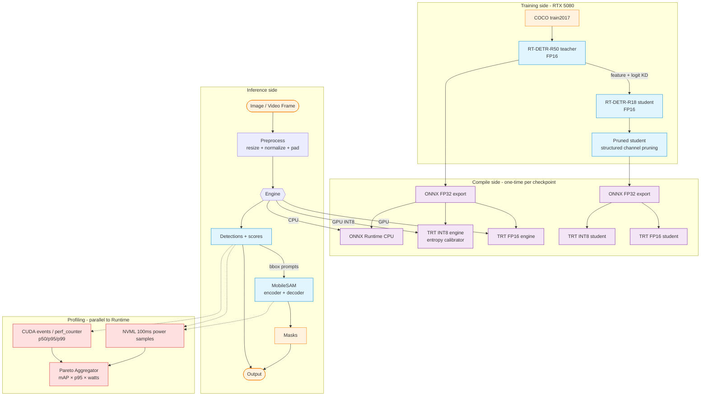

# Architecture — edge-vision

## High-level dataflow



## Module map

| Module | Responsibility | Key files |
|---|---|---|
| `data/` | COCO loaders + RT-DETR preprocessing | `coco_loader.py`, `preprocessor.py` |
| `models/` | RT-DETR + MobileSAM wrappers | `rtdetr_wrapper.py`, `mobilesam_wrapper.py` |
| `distillation/` | R50 → R18 KD training | `student_train.py`, `loss.py` |
| `pruning/` | Structured channel pruning | `structured_prune.py` |
| `quantization/` | TRT INT8 + ONNX QDQ | `calib_dataset.py`, `trt_int8.py`, `onnx_qdq.py` |
| `compile/` | ONNX export + TRT build + ORT exec | `onnx_export.py`, `trt_build.py`, `onnxrt_cpu.py` |
| `inference/` | Latency-measurement harness | `latency_harness.py` |
| `profiling/` | NVML power + thermal + CPU profile | `nvml_power.py`, `thermal_runner.py`, `cpu_profile.py` |
| `evaluation/` | mAP + quant-eval + Pareto aggregation | `coco_eval.py`, `quant_eval.py`, `pareto_aggregator.py` |
| `dashboard/` | Streamlit Pareto + live demo | `pareto_plot.py`, `live_demo.py` |
| `api/` | FastAPI inference service | `main.py` |

## Design principles

1. **ONNX-first.** Every model is exported to ONNX before any backend-specific compilation. This is the only contract that lets the Jetson stub stay one config change away.
2. **Two real targets, not "edge in spirit."** RTX 5080 (TensorRT) and CPU (ONNX Runtime) are both first-class, both tested, both demoed. Jetson is a clearly-marked Phase 7 stub, not a load-bearing claim.
3. **Every measurement has a script.** Pareto rows are not hand-typed — they come from `scripts/run_*_sweep.py` writing JSON, then `pareto_aggregator.py` reading it. Reproducibility checklist in `DEPLOYMENT.md`.
4. **CPU smoke for everything.** Distillation, quantization, profiling — every module has a CPU-runnable smoke that CI exercises. GPU runs are gated behind `pytest -m gpu` and `workflow_dispatch`.
5. **Honest failure modes.** Per-class mAP drop. Thermal-throttle events. Distillation null results. The interview pitch is the failure analysis, not the headline number.

## Data + checkpoint conventions

```
data/
├── coco/
│   ├── annotations/          # instances_val2017.json, instances_train2017.json
│   ├── val2017/              # 5000 images
│   └── train2017/            # 118k images (only pulled if running Phase 4 full distill)
└── calibration/
    └── coco_int8_500.json    # 500 stratified image IDs for INT8 PTQ

checkpoints/
├── rtdetr_r50_torch.pth      # Phase 1 baseline
├── rtdetr_r50.onnx           # Phase 2 export
├── rtdetr_r50_fp16.engine    # Phase 2 (built per-host; do not commit)
├── rtdetr_r50_int8.engine    # Phase 3 (built per-host)
├── rtdetr_r18_distilled.pth  # Phase 4 student
├── rtdetr_r18_distilled.onnx
├── rtdetr_r18_distilled_fp16.engine
├── rtdetr_r18_distilled_int8.engine
└── mobilesam.{onnx,engine}   # Phase 6
```

`*.engine` files are gitignored — they're not portable across GPUs and must be rebuilt per host.

## Reuse map

Several patterns were adapted from the author's sibling portfolio projects rather than written from scratch:

| Need | Adapted from | What it gives us |
|---|---|---|
| `Segmenter` interface for MobileSAM | [sceneiq](https://github.com/sandroama/sceneiq) `perception/segmentation_sam2.py` | Same protocol, drop-in mock-or-real switch |
| IoU + per-class P/R/F1 helpers | [sceneiq](https://github.com/sandroama/sceneiq) `evaluation/detection_eval.py` | Avoid re-implementing the basics |
| Quantization-bench harness shape | [finops-agent](https://github.com/sandroama/finops-agent) `llm_optimization/quantization_bench.py` | p50/p95 + fingerprint-overlap pattern |
| Pareto aggregator | [finops-agent](https://github.com/sandroama/finops-agent) `llm_optimization/quality_per_dollar.py` | JSON-in, frontier-out skeleton |
| KD training loop | [finops-agent](https://github.com/sandroama/finops-agent) `llm_optimization/distillation/student_train.py` | CE+KL loss with temperature, mock-teacher path |
